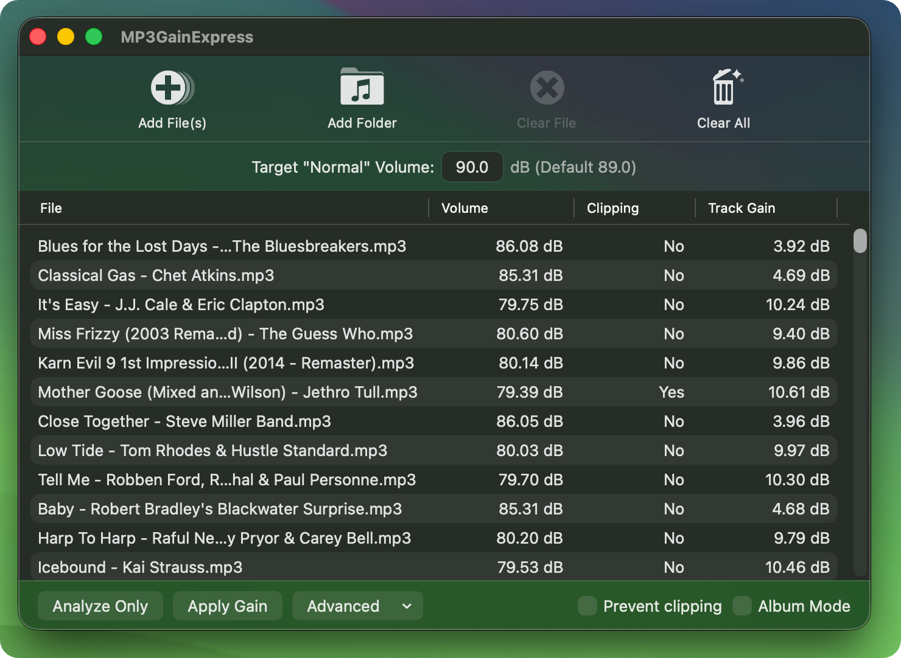

MP3GainOSX
==========

MP3Gain Express for macOS. Migrated from Objective-C to SwiftUI.

**Note**: *Paul Kratt* is the developer of MP3GainOSX. This is the content of the original README. At the end you can read the changes I've made to the project.

## Credits

Based on:

- MP3Gain by *Glen Sawyer* with AACGain by *David Lasker*
- mp3gainOSX (macOS Express version) by *Paul Kratt*

## What is MP3Gain?

MP3Gain is a tool to increase or decrease the volume of MP3 files without re-encoding them. This is useful when you have a lot of music at different volumes, you can use this tool to make everything the same volume so that you don't need to adjust the volume on your MP3 player when listening to your music on shuffle.

## Plattform

- macOS 13+ (`SwiftUI.Table` availability)
- Xcode 15+

## License information

MP3Gain is LGPL. I guess this port is LGPL then, you should adhere to the terms of that license.

See the orignal website for more details:

`http://projects.sappharad.com/mp3gain/`

## Build Instructions

* **aacgain command line**
  * There is an XCode project in the aacgain folder. It requires a pre-configured build environment to work, so the easiest thing to do would be to build the CMake version via the terminal then the XCode project will be able to build going forward
  * The configure process generates some files like `config.h` for `libplatform` in `libmp4v2`, so at the bare minimum you could just try building the XCode project and every time you get an error you run `./configure` for the project that has missing files
  * Once you've built the command line version at least once, the files you need will exist and you can just use the XCode project to build a universal binary instead
  * There is a [repository](https://github.com/Sappharad/aacgain) for aacgain
* **MP3GainExpress**
  * Just open and build the Xcode project.

## Main changes

These are the main changes I've made to the project:

- Fix large file lists crash
- Simplified progress window
- Improved memory management
- Modern filetype handling
- User interface improvements
- Sparkle updated to version 2.9.0
- Language support with language selector (menu language or `⌘ + L`)
- Translate MP3GainExpress from Objective-C to SwiftUI:
   - Objective-C → Swift (step 1)
   - Swift → SwiftUI (step 2).
